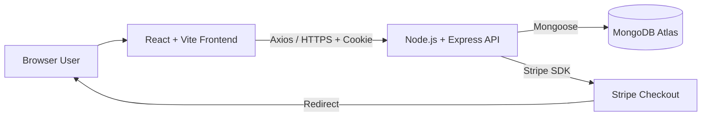
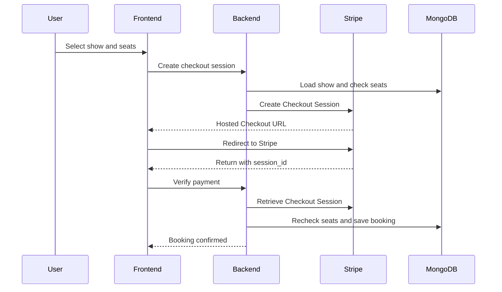
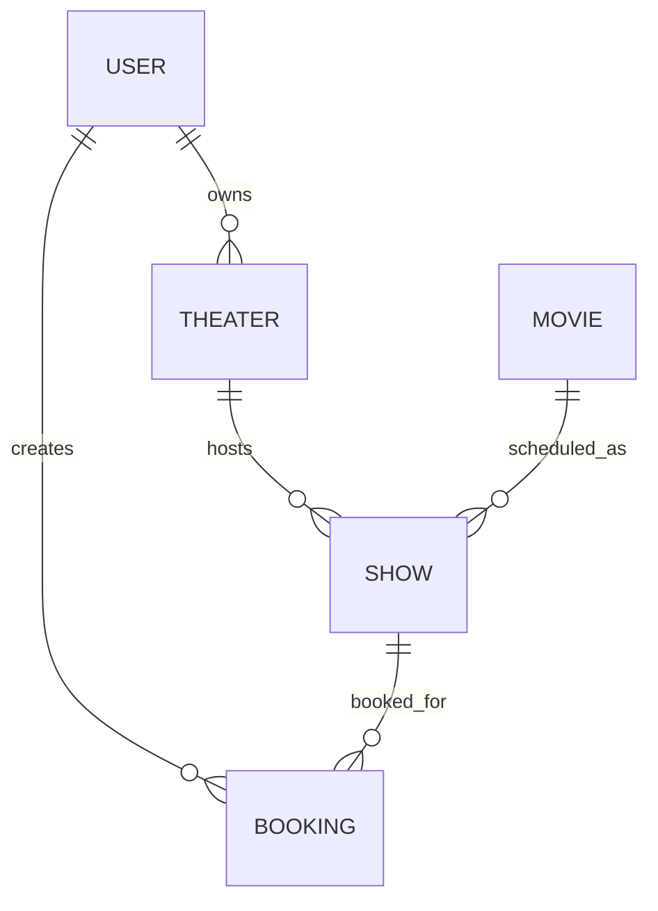

# BookMyShow — Full-Stack Movie Ticket Booking Platform

A full-stack MERN movie-ticket booking application with authentication, theater/show management, seat selection, Stripe Checkout, booking history, admin workflows, and cloud deployment.

[Live Demo](https://bookmyshow-frontend-ten.vercel.app) · [Backend Deployment](https://bookmyshow-backend-lrkh.onrender.com) · [Frontend Repo](https://github.com/kvp9743/bookmyshow-frontend) · [Backend Repo](https://github.com/kvp9743/bookmyshow-backend)

## Project Highlights

- Complete booking journey: movie discovery → show selection → seat selection → Stripe Checkout → payment verification → booking.
- JWT authentication stored in an HTTP-only cookie.
- Password hashing with bcrypt.
- Users can register theaters; administrators approve or block theater listings.
- Approved theater owners can create and manage shows.
- MongoDB/Mongoose relationships connect users, theaters, movies, shows, and bookings.
- Backend calculates payment amount from stored ticket prices instead of trusting a frontend total.
- Stripe Session IDs are stored uniquely to prevent duplicate booking creation on success-page refresh.
- Frontend and backend are deployed separately on Vercel and Render with MongoDB Atlas as the database.

## Tech Stack

| Layer | Technologies |
| --- | --- |
| Frontend | React, Vite, React Router, Redux Toolkit, Tailwind CSS, Ant Design, Axios, Moment.js |
| Backend | Node.js, Express.js, Mongoose |
| Database | MongoDB Atlas |
| Authentication | JWT, HTTP-only cookies, bcrypt |
| Payments | Stripe Checkout |
| Deployment | Vercel, Render |
| Version Control | Git, GitHub |

## Core Features

### User
- Register, login, and logout.
- Browse and search movies.
- View movie details and date-based shows.
- View shows grouped by theater.
- Select available seats from a visual seating layout.
- Pay through Stripe-hosted Checkout.
- View confirmed tickets and booking history.

### Theater Owner
- Add, edit, and delete theater entries.
- View approval status.
- Manage shows after theater approval.
- Configure show date, time, movie, ticket price, and seat capacity.

### Administrator
- Add, edit, and delete movies.
- View registered theaters.
- Approve or block theater listings.

## Architecture



The frontend uses an Axios instance with credentials enabled. The backend configures credentialed CORS for the frontend origin, allowing the HTTP-only authentication cookie to work across the separately deployed frontend and API.

## Booking and Payment Flow



### Payment safeguards implemented
- Ticket total is calculated on the backend from the show document.
- Selected seats are checked before creating a Checkout Session.
- Stripe payment status is verified server-side.
- Stripe metadata ties the session to the authenticated user and show.
- Seats are checked again during payment verification.
- Booking sessionId is unique, preventing duplicate booking records for one Stripe session.

## Authentication and Authorization

- Passwords are salted and hashed with bcrypt.
- Login signs a JWT containing the user ID.
- The JWT is stored in the bmstoken HTTP-only cookie.
- Production cookies use secure=true and sameSite=none.
- Protected routes verify the token and attach req.userId.
- Movie mutations use additional adminVerification middleware.
- Theater activation can only be changed when the authenticated user is an administrator.

## Data Relationships



Main collections: User, Movie, Theater, Show, and Booking. Mongoose populate is used to return related movie, theater, show, owner, and booking information where required.

## Repository Structure

```text
bookmyshowClone/
├── BookMyShow/
│   ├── client/
│   │   ├── src/
│   │   ├── package.json
│   │   ├── vite.config.js
│   │   └── vercel.json
│   └── server/
│       ├── Controller/
│       ├── DBconnect/
│       ├── Middleware/
│       ├── Model/
│       ├── Routes/
│       ├── package.json
│       └── server.js
└── README.md
```

Frontend and backend are also maintained in separate repositories because they are deployed independently.

## Local Setup

### Prerequisites
- Node.js and npm
- MongoDB or MongoDB Atlas
- Stripe account and secret key

### Backend
```bash
cd BookMyShow/server
npm install
npm run dev
```

Backend .env:
```env
PORT=8080
NODE_ENV=development
FRONTEND_URL=http://localhost:5173
dbURL=your_mongodb_connection_string
secretKey=your_jwt_secret
stripeSecretKey=your_stripe_secret_key
```

### Frontend
```bash
cd BookMyShow/client
npm install
npm run dev
```

Frontend .env:
```env
VITE_API_URL=http://localhost:8080
```

## Deployment

### Frontend — Vercel
Live application: **https://bookmyshow-frontend-ten.vercel.app**

Production API configuration:
```env
VITE_API_URL=https://bookmyshow-backend-lrkh.onrender.com
```

The frontend includes a Vercel SPA rewrite so React Router URLs work after direct refreshes.

### Backend — Render
Backend deployment: **https://bookmyshow-backend-lrkh.onrender.com**

Production configuration includes:
```env
NODE_ENV=production
FRONTEND_URL=https://bookmyshow-frontend-ten.vercel.app
```

MongoDB Atlas provides the production database.

## API Modules

| Module | Responsibility |
| --- | --- |
| User | Registration, login, logout, current-user details |
| Movies | Movie listing/details and admin CRUD |
| Theaters / Shows | Theater management, approval status, show management and discovery |
| Booking | Stripe session creation, payment verification, booking history |

See the [backend repository](https://github.com/kvp9743/bookmyshow-backend) for endpoint-level documentation.

## Current Limitations / Future Improvements

The following are useful production improvements but are **not currently implemented**:

- Temporary seat holds before payment.
- Stripe webhooks.
- Atomic seat reservation or MongoDB transactions for concurrency handling.
- Stronger server-side ownership checks for theater/show mutation endpoints.
- Rate limiting.
- Helmet security headers.
- MongoDB query sanitization.
- Automated unit, integration, and end-to-end tests.
- Email or SMS ticket confirmations.
- Caching and additional production monitoring.

## Key Engineering Takeaways

- End-to-end frontend/backend workflow design.
- Mongoose references and population across related collections.
- JWT authentication with cross-origin HTTP-only cookies.
- Role-aware authorization.
- Server-side Stripe payment verification.
- Production CORS and SameSite cookie configuration.
- Independent frontend/API deployment with environment-based configuration.

## Related Repositories

- Frontend: https://github.com/kvp9743/bookmyshow-frontend
- Backend: https://github.com/kvp9743/bookmyshow-backend

## Author

**Kiran Pawar**

GitHub: https://github.com/kvp9743

---

> **Note:** This is an independent educational full-stack project inspired by movie-ticket booking workflows. It is not affiliated with or endorsed by BookMyShow.